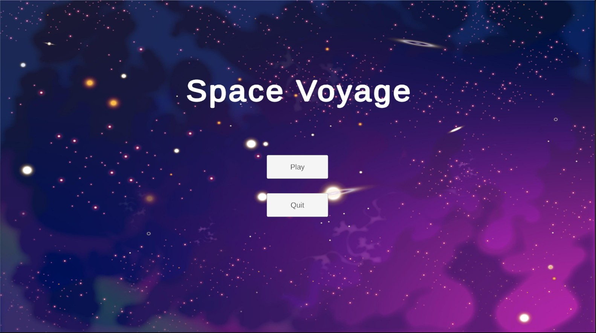
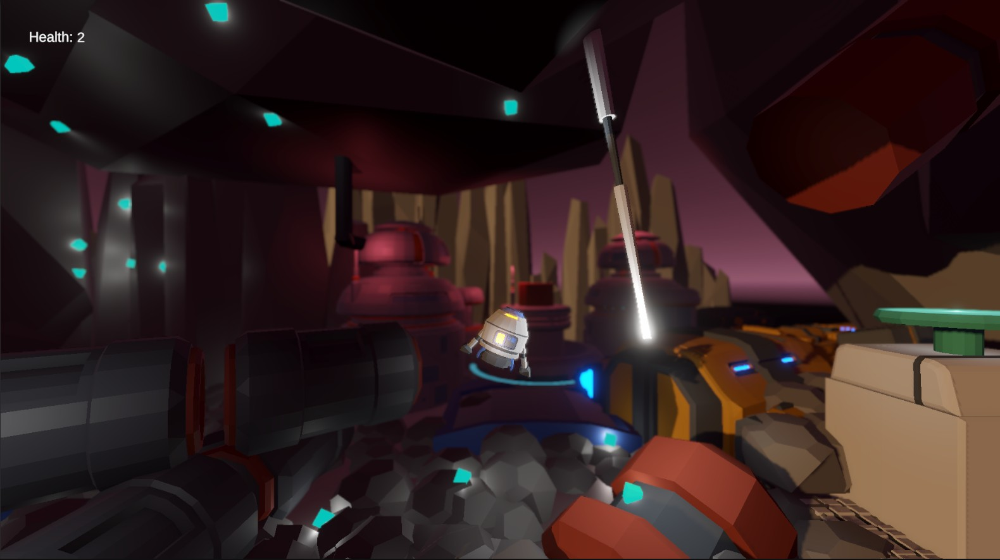
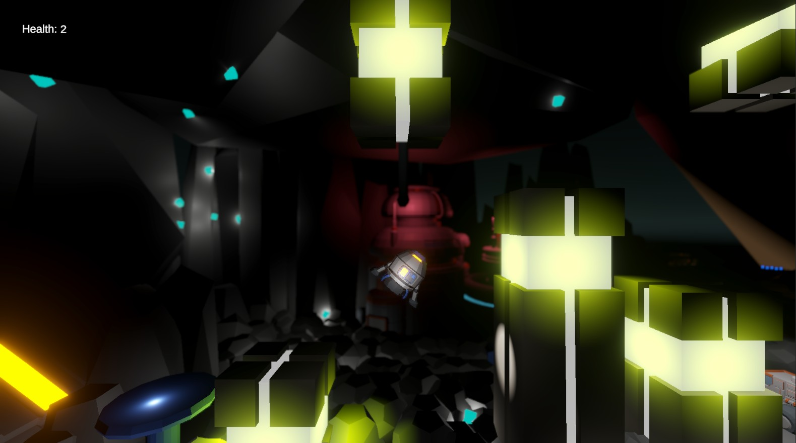

#  :rocket: Space Voyage

Space Voyage is a small 3D space exploration game built with Unity, set in a dark and mysterious galaxy that was once home to an advanced civilization. The game challenges players to navigate through space, avoid obstacles, and safely land on designated platforms to progress through levels.

You can play the game by downloading it from the 'Build' folder for your desire OS.

## :video_game: Game Overview
- Engine: Unity (3D)
- Language: C#
- Game Type: Obstacle-avoidance & precision landing
- Current Levels:
    -Main Menu
    -Level 1
    -Level 2

The objective of each level is to avoid obstacles and land safely on the green landing pad to complete the level. 

## :muscle: What I Learned

This project helped me gain hands-on experience with Game development using Unity, writing gameplay logic in C#, scene management (Menu, Level 1, Level 2), collision detection and physics, audio effects and particle systems, level design and player controls
Overall, it was a fun learning experience that strengthened my understanding of both C# programming and Unity’s game development workflow.

## :camera: Screenshots

### Main Menu

### Level 1

### Level 2

## :cloud: Future Improvement

The game can be enhanced further by adding:
- More levels with increasing difficulty
- Advanced obstacle patterns and moving hazards
- Fuel or time-based challenges

## :video_camera: Videos:

https://github.com/user-attachments/assets/21767d6d-bc46-4e05-aff7-1422eed9659e

